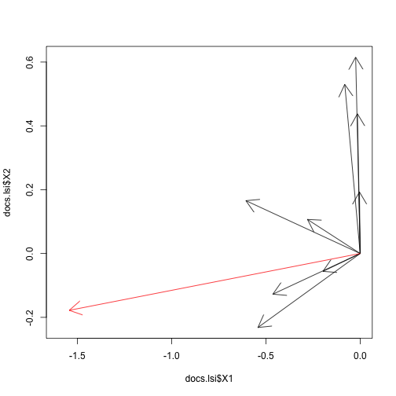

## What is SVD?

$$latex
A = U \Sigma V^{T}
$$

$A$ is m x n matrix

$U$ is m x k orthonormal matrix 

$V$ is n x k orthonormal matrix

$\Sigma$ is k x k - diagonal matrix

---

## Latent Semantic Analysis

Application of SVD to term-document matrices


```
## [1] "Human machine interface for Lab ABC computer applications"    
## [2] "A survey of user opinion of computer system response time"    
## [3] "The EPS user interface management system"                     
## [4] "System and human system engineering testing of EPS"           
## [5] "Relation of user-perceived response time to error measurement"
## [6] "The generation of random, binary, unordered trees"            
## [7] "The intersection graph of paths in trees"                     
## [8] "Graph minors IV: Widths of trees and well-quasi-ordering"     
## [9] "Graph minors: A survey"
```

Documents (Deerwester et al. (1990), Table 2, Part 1)

---

## Term-Document Matrix


```r
df <- read.csv(file="matrix.csv")
print(df, row.names=F)
```

```
##      Terms D1 D2 D3 D4 D5 D6 D7 D8 D9
##      human  1  0  0  1  0  0  0  0  0
##  interface  1  0  1  0  0  0  0  0  0
##   computer  1  1  0  0  0  0  0  0  0
##       user  0  1  1  0  1  0  0  0  0
##     system  0  1  1  2  0  0  0  0  0
##   response  0  1  0  0  1  0  0  0  0
##       time  0  1  0  0  1  0  0  0  0
##        EPS  0  0  1  1  0  0  0  0  0
##     survey  0  1  0  0  0  0  0  0  1
##      trees  0  0  0  0  0  1  1  1  0
##      graph  0  0  0  0  0  0  1  1  1
##     minors  0  0  0  0  0  0  0  1  1
```

---

## Let's compute SVD


```r
df.svd <- svd(df[,-1])
scales <- df.svd$d[1:2]
scales
```

```
## [1] 3.3 2.5
```

--- 

## Term Space


```r
termVectors <- df.svd$u[,1:2]
terms.lsi <- data.frame(termVectors, terms)
print(terms.lsi, row.names=F)
```

```
##      X1     X2     terms
##  -0.221 -0.113     human
##  -0.198 -0.072 interface
##  -0.240  0.043  computer
##  -0.404  0.057      user
##  -0.644 -0.167    system
##  -0.265  0.107  response
##  -0.265  0.107      time
##  -0.301 -0.141       EPS
##  -0.206  0.274    survey
##  -0.013  0.490     trees
##  -0.036  0.623     graph
##  -0.032  0.451    minors
```

---

## Document Space


```r
docVectors <- df.svd$v[,1:2]
docs.lsi <- data.frame(docVectors, Docs=strtrim(docs, 50))
print(docs.lsi, row.names=F, col.names=F)
```

```
##       X1     X2                                               Docs
##  -0.1974 -0.056 Human machine interface for Lab ABC computer appli
##  -0.6060  0.166 A survey of user opinion of computer system respon
##  -0.4629 -0.127           The EPS user interface management system
##  -0.5421 -0.232 System and human system engineering testing of EPS
##  -0.2795  0.107 Relation of user-perceived response time to error 
##  -0.0038  0.193  The generation of random, binary, unordered trees
##  -0.0146  0.438           The intersection graph of paths in trees
##  -0.0241  0.615 Graph minors IV: Widths of trees and well-quasi-or
##  -0.0820  0.530                             Graph minors: A survey
```

---

## Query "Human computer interaction"


```r
human <- as.numeric(terms.lsi[terms.lsi$terms == "human", 1:2])
computer <- as.numeric(terms.lsi[terms.lsi$terms == "computer", 1:2])
query <- human + computer
print(query)
```

```
## [1] -0.46 -0.07
```

$(0.22, -0.11) + (0.24, 0.04) = (0.46, -0.07)$

---

## Document Scores VS Query

Cosine distance: $Cos\theta =  \frac{a \cdot b}{||a|| ||b||}$


```r
y <- (scales * query)
scores <- apply(docs.lsi[,1:2], 1, function(x) x %*% y / sqrt(x%*%x * y%*%y))
print(data.frame(scores, docs), row.names=F)
```

```
##  scores                                                          docs
##    0.99     Human machine interface for Lab ABC computer applications
##    0.93     A survey of user opinion of computer system response time
##    0.99                      The EPS user interface management system
##    0.96            System and human system engineering testing of EPS
##    0.89 Relation of user-perceived response time to error measurement
##   -0.09             The generation of random, binary, unordered trees
##   -0.08                      The intersection graph of paths in trees
##   -0.08      Graph minors IV: Widths of trees and well-quasi-ordering
##    0.04                                        Graph minors: A survey
```

--- 

## Query and Document Space


```r
plot(docs.lsi$X1, docs.lsi$X2, type="n", xlim = c(-1.6, 0))
arrows(0,0, docs.lsi$X1, docs.lsi$X2)
arrows(0,0, scales[1]*query[1], scales[2]*query[2], col=2)
```

 

---

## Term Scores VS Query


```r
y <- (scales * query)
scores <- apply(terms.lsi[,1:2], 1, function(x) x %*% y / sqrt(x%*%x * y%*%y))
print(data.frame(scores, terms), row.names=F)
```

```
##  scores     terms
##    0.94     human
##    0.97 interface
##    0.96  computer
##    0.97      user
##    0.99    system
##    0.88  response
##    0.88      time
##    0.95       EPS
##    0.51    survey
##   -0.09     trees
##   -0.06     graph
##   -0.04    minors
```

---

## Let's dive into math
Row Space -> Column Space

$AV = U \Sigma$


```
##      Terms D1 D2 D3 D4 D5 D6 D7 D8 D9
##      human  1  0  0  1  0  0  0  0  0
##  interface  1  0  1  0  0  0  0  0  0
##   computer  1  1  0  0  0  0  0  0  0
##       user  0  1  1  0  1  0  0  0  0
##     system  0  1  1  2  0  0  0  0  0
##   response  0  1  0  0  1  0  0  0  0
##       time  0  1  0  0  1  0  0  0  0
##        EPS  0  0  1  1  0  0  0  0  0
##     survey  0  1  0  0  0  0  0  0  1
##      trees  0  0  0  0  0  1  1  1  0
##      graph  0  0  0  0  0  0  1  1  1
##     minors  0  0  0  0  0  0  0  1  1
```

---

## Simplifications 

$A = U \Sigma V^{-1} = U \Sigma V^{T}$
  
$A^{T} A = V \Sigma^{T} U^{T} U \Sigma V^{T} = V \Sigma^2 V^{T}$

$A A^{T} = U \Sigma V^{T} V \Sigma^{T} U^{T}= U \Sigma^2 U^{T}$

But what is $U$, $\Sigma$, $V$?

--- 

## Matrix Spectral Theorem

There exists an orthonormal basis of Q consisting of eigenvectors of B. Each eigenvalue is real

$B = Q \Lambda Q^{T}$

And our $AA^{T}$ is like B, squared, symmetric 

But what is eigenvalues and eigenvectors?

--- 

## Eigenvalues

$Ax = \lambda x$ 


--- 

## Solve 

$Ax - \lambda x = 0$

$(A - \lambda I) x = 0$

$A - \lambda I = 0$

$\lambda$ - eigenvalues

$x$ - eigenvectors

--- 

## Algorithm to find SVD

 1. Find eigenvectors $U$ of $A A^{T}$ 
 
 2. Find eigenvectors $V$ of $A^{T} A$
 
 3. The non-zero singular values of $A$ found on the diagonal entries of $\Sigma$ are the square roots of the non-zero eigenvalues of both $A A^{T}$ and $A^{T} A$.

That's it!

---  
 
## Eigenvalues


---
## Links

MIT Professor Gilbert Strang teaching 18.06:
http://ocw.mit.edu/courses/mathematics/18-06-linear-algebra-spring-2010/video-lectures/

SVD Tutorial:
http://alias-i.com/lingpipe/demos/tutorial/svd/read-me.html

Wiki: http://en.wikipedia.org/wiki/Singular_value_decomposition

---
## Contacts

### Nikolay Pavlov, Founder at Biomech
 
* E-mail: me@nikolaypavlov.com 
* Linkedin: http://linkedin.com/in/nikolaypavlov
* Facebook: http://www.facebook.com/pav.nikolay
* Twitter: https://twitter.com/nikolaypavlov
* Github: https://github.com/nikolaypavlov

